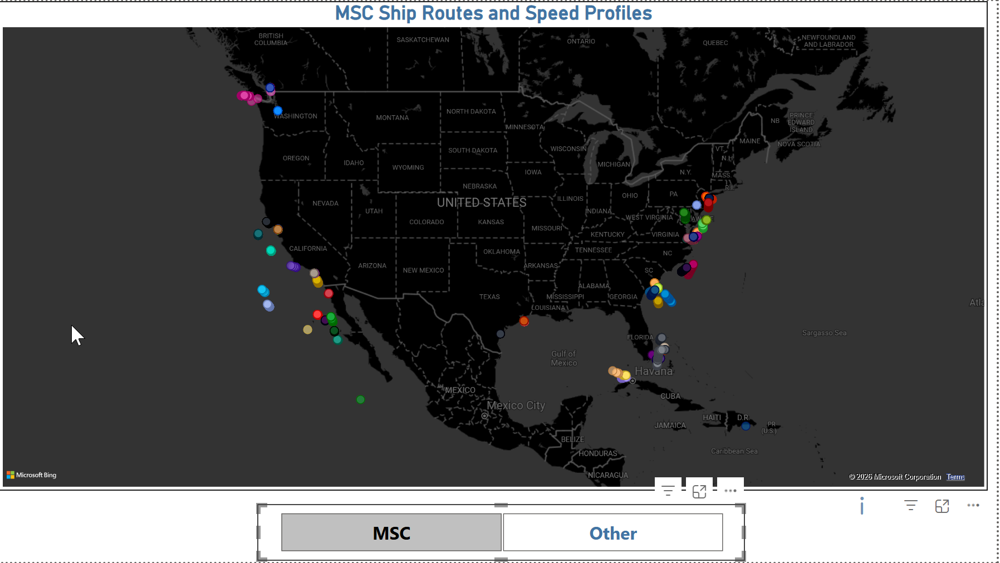
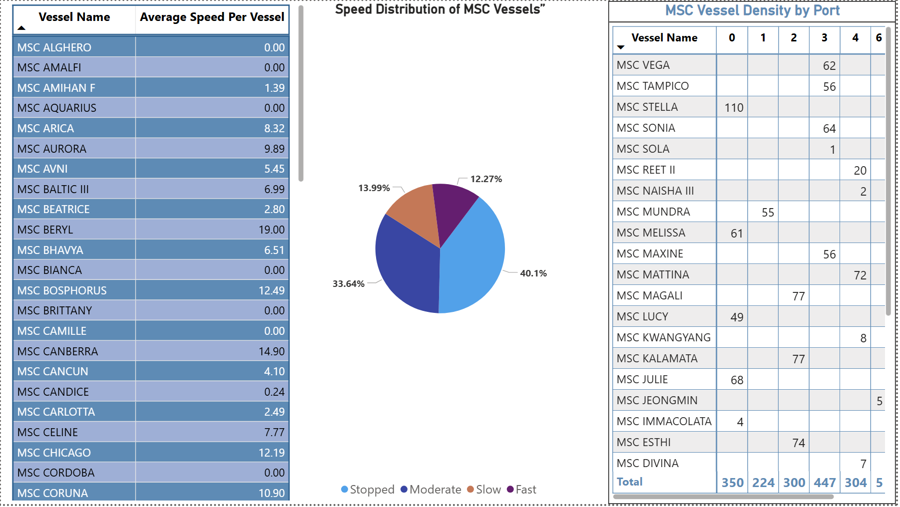
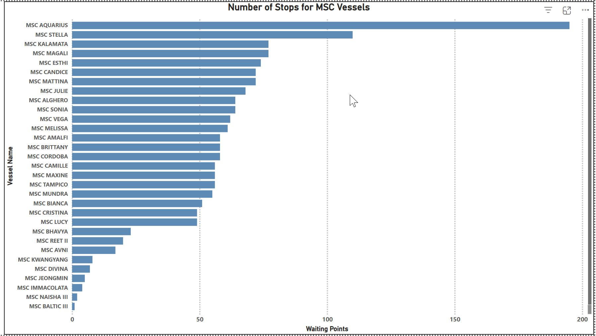

# 🚢 MSC Ship Routes & Vessel Dynamics Analysis

---

## 🇬🇧 English

### 📌 Project Overview

This project analyzes **MSC vessel movements** using AIS (Automatic Identification System) data.
The objective is to explore vessel routes, speed behavior, and port activity through data analysis and interactive dashboards.

---

### 📊 Data Source

Dataset:
https://www.kaggle.com/datasets/satyamrajput7913/ais-ship-tracking-vessel-dynamics-and-eta-data/data

---

### ⚙️ Tools & Technologies

* Python (Pandas, NumPy)
* Power BI
* DAX (Data Analysis Expressions)

---

### 🔍 Workflow

* **Python**

  * Initial data exploration
  * Data quality checks

* **Power BI**

  * Data cleaning and transformation
  * Column type adjustments
  * Data modeling

* **DAX**

  * Custom measures
  * Aggregations and calculated fields

---

## 📊 Dashboard & Visualizations

### 🗺️ MSC Ship Routes & Speed Profiles

📌 *This map shows vessel routes along with speed variations.*

---

### ⚓ Vessel Density by Port

📌 *Highlights port congestion and traffic intensity.*

---

### 🛑 Number of Stops per Vessel

📌 *Displays how frequently vessels stop during their routes.*

---

### 📌 Key Insights

* Major shipping routes are clearly identifiable
* Some ports show significantly higher vessel density
* Speed variability indicates operational differences
* Stop patterns reveal vessel behavior trends

---

### ⚠️ Notes

* Dataset is not included due to size limitations
* This project is for exploratory analysis and visualization

---

---

## 🇮🇹 Italiano

### 📌 Panoramica del Progetto

Questo progetto analizza i movimenti delle navi **MSC** utilizzando dati AIS.
L’obiettivo è studiare rotte, velocità e attività nei porti tramite dashboard interattive.

---

### 📊 Fonte dei Dati

Dataset:
https://www.kaggle.com/datasets/satyamrajput7913/ais-ship-tracking-vessel-dynamics-and-eta-data/data

---

### ⚙️ Strumenti e Tecnologie

* Python (Pandas, NumPy)
* Power BI
* DAX

---

### 🔍 Workflow

* **Python**

  * Analisi iniziale dei dati
  * Controllo qualità

* **Power BI**

  * Pulizia e trasformazione dati
  * Modifica tipi di colonne
  * Modellazione dati

* **DAX**

  * Misure personalizzate
  * Campi calcolati

---

## 📊 Dashboard e Visualizzazioni

### 🗺️ Rotte Navi MSC e Velocità

📌 *Mappa delle rotte con variazioni di velocità.*

---

### 🚀 Distribuzione della Velocità

📌 *Distribuzione delle velocità delle navi.*

---

### 🛑 Numero di Fermate per Nave

📌 *Frequenza delle fermate per ogni nave.*

---

### 📌 Insight Principali

* Identificazione delle principali rotte marittime
* Alcuni porti risultano molto più congestionati
* Variabilità della velocità significativa
* Pattern di fermate delle navi

---

### ⚠️ Note

* Dataset non incluso per limiti di dimensione
* Progetto a scopo di analisi esplorativa

---
